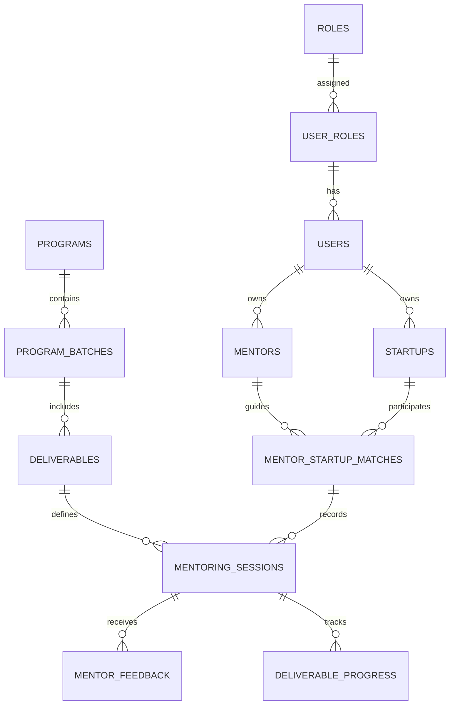
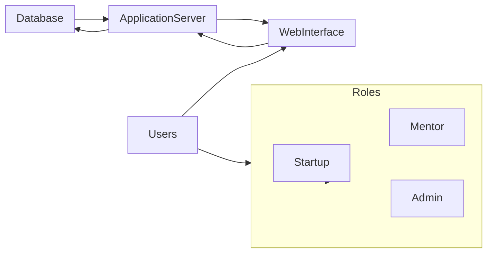
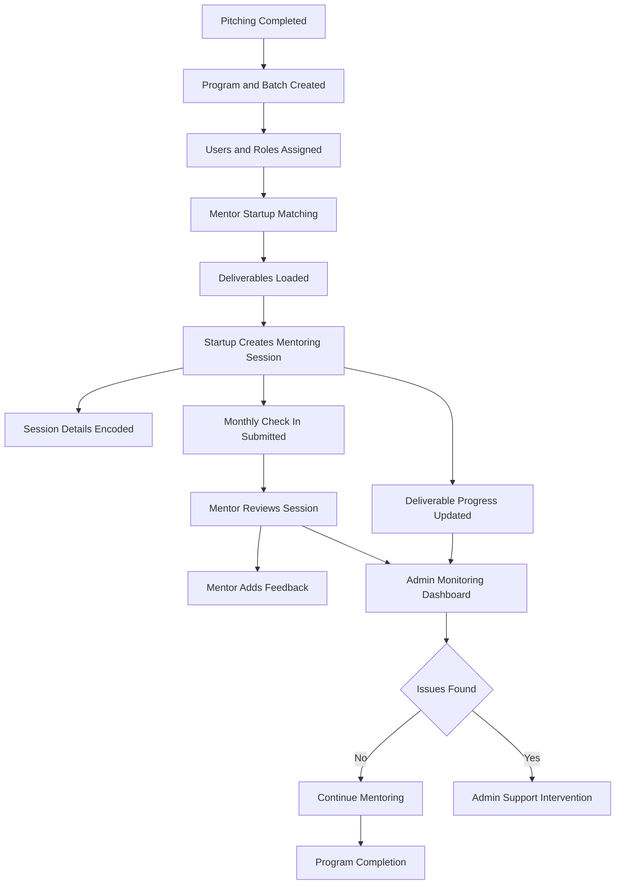
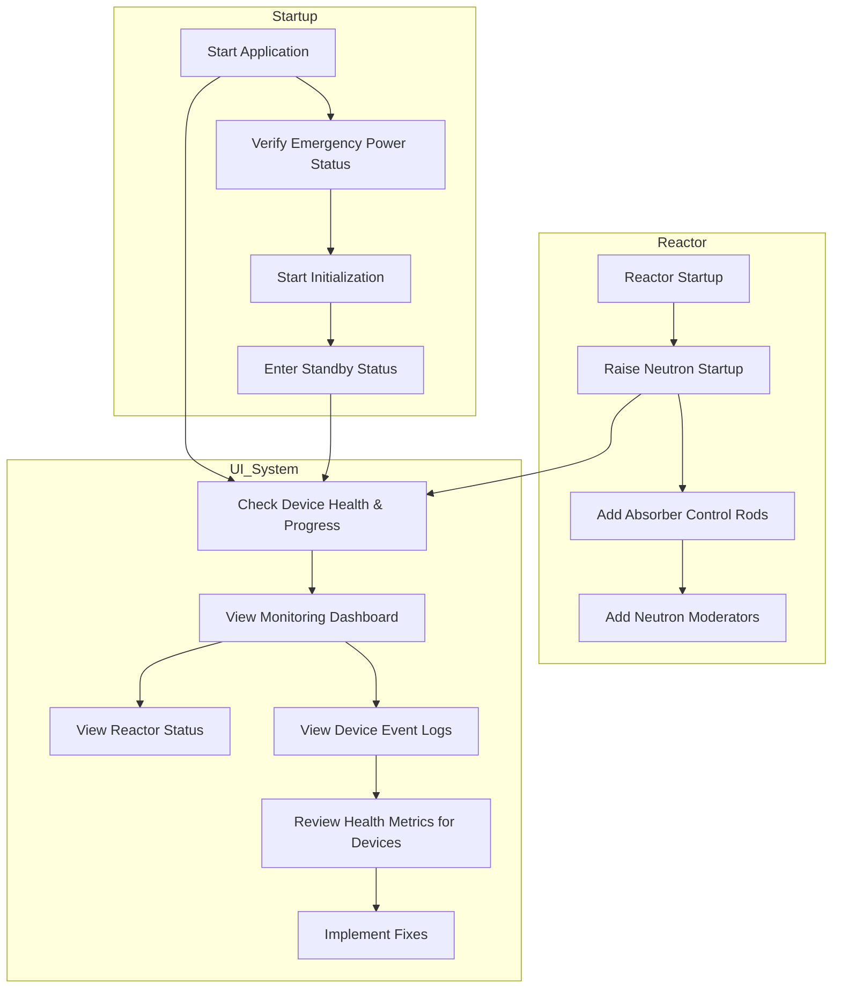
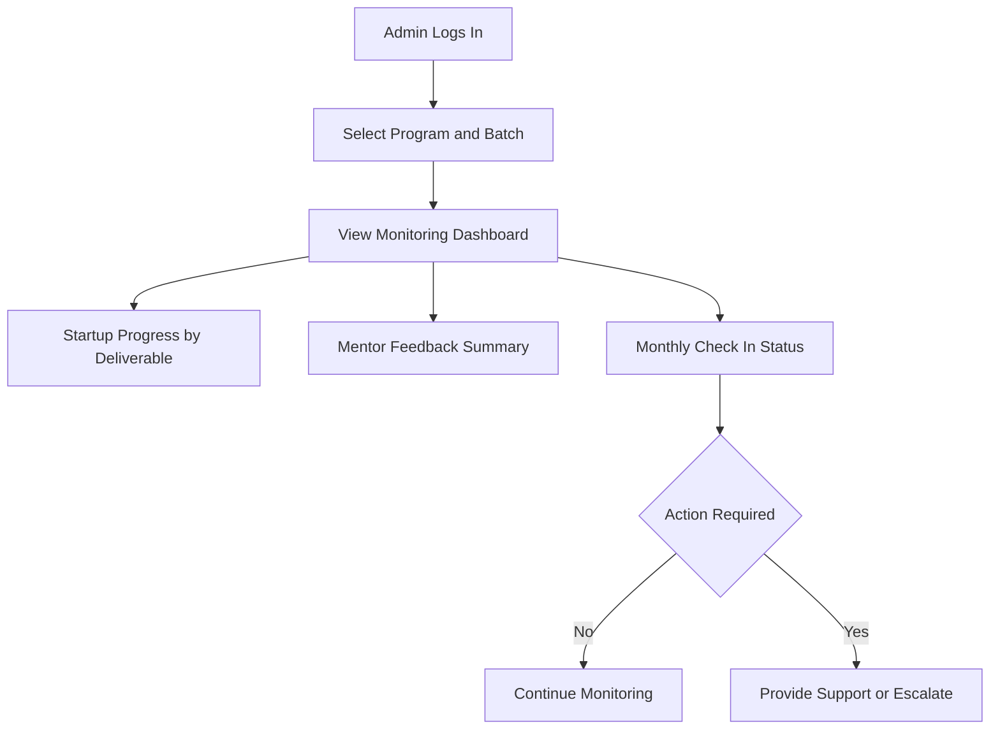

# MentorMatch Post-Pitch Support System

## System Development Proposal & Documentation

**Prepared for:** DTI Region 6  
**Date:** December 2025  
**Version:** 1.0

---

## Table of Contents

1. [Background](#background)
2. [Objectives](#objectives)
3. [System Outputs](#system-outputs)
4. [System Outcomes](#system-outcomes)
5. [System Components](#system-components)
6. [System Database Design](#system-database-design)
7. [Workflow / User Flow](#workflow--user-flow)
8. [Risk Management](#risk-management)
9. [System Development Approach](#system-development-approach)
10. [Project Deliverables](#project-deliverables)
11. [Annexes](#annexes)

---

## Background

The MentorMatch Post-Pitch Support System is designed to support early-stage startups that participated in the MentorMatch Startup Pitching Competition under the Moonshot TNK 2.0 Program. The system enables structured post-pitch mentoring, monitoring of mentor-startup engagements, tracking of deliverables, and real-time reporting.

### The system addresses the need for:

- Structured mentor-startup collaboration
- Continuous tracking of startup progress and milestone achievement
- Data-driven monitoring and reporting for DTI staff
- Role-based access for mentors, startups, and admin staff

---

## Objectives

The post-pitch mentoring system aims to:

- Provide a digital platform for tracking mentor-startup engagements and deliverables
- Enable startups to log progress on mentoring activities, milestones, and challenges
- Allow mentors to provide guidance, comments, and recommendations
- Generate real-time dashboards and reports for DTI admin staff to monitor program effectiveness
- Ensure role-based access and security to protect sensitive startup data
- Integrate monitoring, reporting, and data analytics for informed decision-making

---

## System Outputs

- Fully functional digital monitoring tool for tracking mentor-startup progress
- Database and dashboards for monitoring mentoring sessions, deliverables, and milestones
- Reports summarizing startup progress, mentor feedback, and actionable insights
- Historical data repository for program evaluation and future scaling

---

## System Outcomes

- Startups have structured guidance and improved operational performance
- Mentors and admin staff can monitor progress effectively through dashboards
- Enhanced program oversight and data-driven decision-making
- Improved transparency, accountability, and program evaluation

---

## System Components

### User Roles & Access

**Admin (DTI Staff)**
- Full access to all startup progress, mentoring sessions, deliverables, and reports
- Can generate dashboards and analytics

**Mentor**
- Read access to detailed startup session info
- Can edit only Comments, Issues, Recommendations for assigned startups

**Startup**
- Can input progress for mentoring sessions, milestones, deliverables, challenges, and upload evidence
- Cannot edit mentor comments

### Core Modules

#### 1. User Management
- Manage users, roles, and access privileges

#### 2. Startup & Mentor Management
- Assign mentors to startups
- Maintain startup profile: name, province, sector, contact info, etc.

#### 3. Deliverables & Mentoring Sessions
- Create main deliverables (e.g., "Introduction to High Value Markets," "Refinement of Business Model")
- Each deliverable linked to multiple mentoring sessions with fields:
  - Session date
  - match_id
  - deliverable_id
  - Session summary
  - Progress
  - Milestones
  - Challenges
  - Evidence/link
  - Status
  - Monthly check-in confirmation

#### 4. Monitoring & Reporting Dashboard
- Generate real-time tables, charts, and KPIs for program evaluation

#### 5. Digital Evidence & Documentation Storage
- Upload supporting documents or links per mentoring session

#### 6. Alerts & Notifications
- Automated reminders for session updates, mentor feedback submission, and milestone deadlines

---

## System Database Design

### Main Tables

- **users** – system users (admin, mentor, startup)
- **roles** – defines role types (admin, mentor, startup)
- **startups** – startup profiles
- **mentors** – mentor profiles
- **matches** – mentor-startup assignment
- **deliverables** – main deliverables (linked to mentoring sessions)
- **mentoring_sessions** – activities under each deliverable
- **progress_tracking** – monitoring fields for admin dashboards
- **documents** – evidence or files uploaded (for enhancement)

*(Refer to table structure for relational schema)*

### Monitoring Fields

For admin dashboards, the system will track:

- Startup Name
- Mentor Assigned
- Province / PO
- Month
- Mentoring Session Date
- Session Summary
- Deliverable 1 Progress
- Deliverable 2 Progress
- Milestones Achieved
- Challenges / Issues
- Support Needed
- Evidence / Link
- Status
- Monthly Check-in Confirmed

**Note:**
- **Mentor Access:** read-only except for Comments / Issues and Recommendations
- **Startup Access:** can input progress and session details

---

## Workflow / User Flow

*(Please refer to flowchart)*

1. Admin assigns mentors to startups
2. Startup logs in and fills progress for mentoring sessions
3. Mentor reviews assigned startup session, adds comments and recommendations
4. Admin monitors progress via dashboard and generates reports
5. Alerts/notifications sent for pending sessions, milestones, and monthly check-ins

---

## Risk Management

| **Risk** | **Action** | **Responsible** | **Timeline** |
|----------|-----------|----------------|--------------|
| Low mentor engagement | Track in system | RO & POs | Before & during program |
| Startup unable to implement recommendations | Follow-up sessions; track in system | Mentor / PO | Ongoing |
| Mentor provides additional opportunities | Track in system; enable dashboard notifications | PO | Ongoing |
| Startup successfully refines business model | Showcase in reports | RO & POs | End of program |
| Digital tool provides actionable data | Regular dashboard review | RO & POs | Monthly/Quarterly |

---

## System Development Approach

- **Front-end:** Web-based, responsive, accessible UI using Bootstrap 5
- **Back-end:** PHP / Laravel (or preferred framework)
- **Database:** MySQL with relational schema
- **Security:** Role-based access control, encrypted passwords, secure uploads
- **Deployment:** Hosted on DTI servers or cloud-based solution with backup

---

## Project Deliverables

- Functional digital monitoring system with dashboards
- Complete database schema and admin interface
- User manual for admin, mentors, and startups
- Training sessions for DTI staff and mentors
- Reports on startup progress, deliverables, and milestones

---

## Annexes

### Annex 1: ER Diagram (Entity-Relationship)

### Annex 2: System Architecture

### Annex 3: Full Process Flow (End-to-End)

### Annex 4: Journey / User Flow

### Annex 5: Admin Monitoring Flow

---

*End of Document*