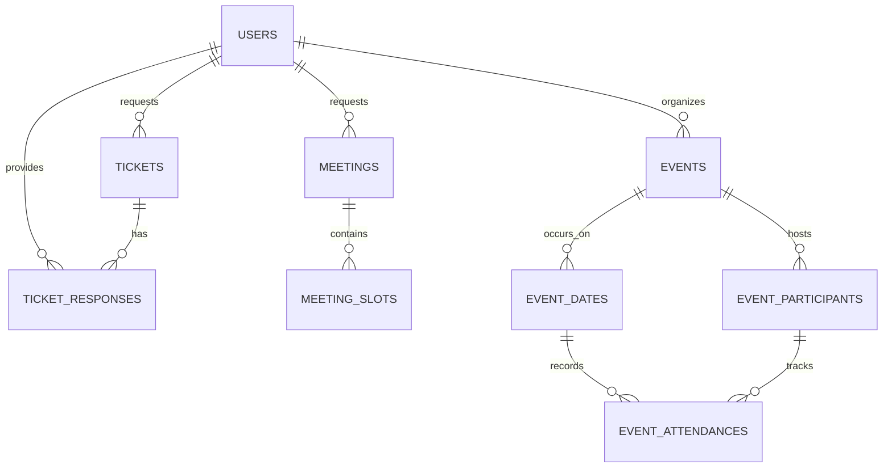
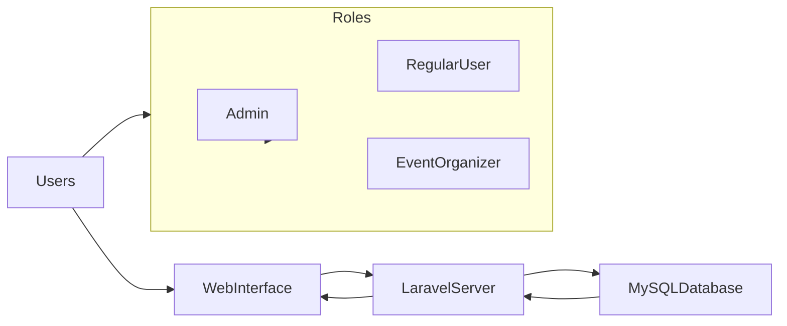
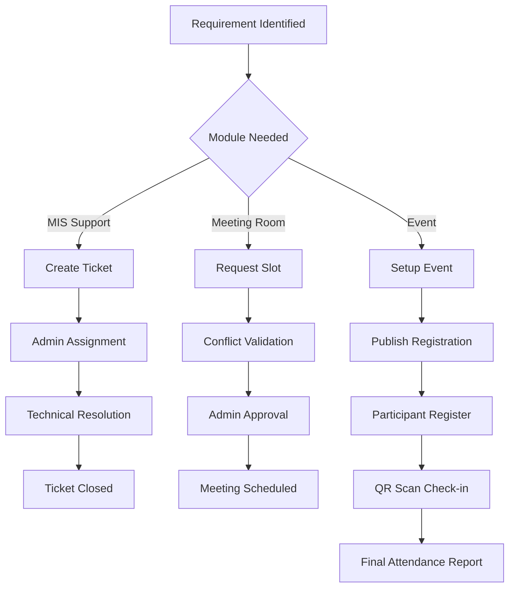
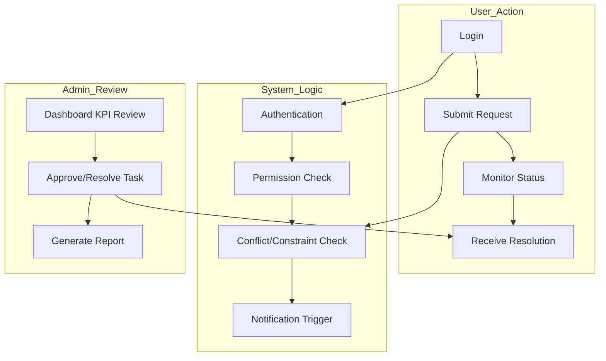
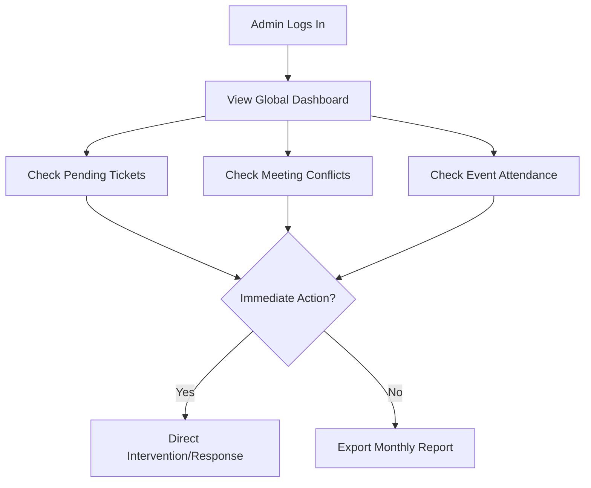

# MIS Services Management System

## System Development Documentation

**Prepared for:** DTI Region 6  
**Date:** January 2026  
**Version:** 1.0

---

## Table of Contents

1. [Background](#background)
2. [Objectives](#objectives)
3. [System Outputs](#system-outputs)
4. [System Components](#system-components)
5. [Core Modules](#core-modules)
6. [Technology Stack](#technology-stack)
7. [System Database Design](#system-database-design)
8. [Workflow / User Flow](#workflow--user-flow)
9. [Annexes](#annexes)

---

## Background

The **MIS Services Management System** is a centralized platform designed for DTI Region 6 to streamline internal technical requests, manage facility schedules, and handle regional event registrations. It replaces fragmented tracking methods with a unified, role-based system that ensures accountability, transparency, and data-driven reporting.

---

## Objectives

The system aims to:

-   **Centralize Technical Support**: Provide a structured ticketing system for hardware, software, and network issues.
-   **Optimize Facility Usage**: Enable a conflict-free meeting scheduler for physical rooms and virtual platforms.
-   **Professionalize Event Management**: Automate event registration, QR-based check-ins, and multi-day attendance tracking.
-   **Enhance Accountability**: Implement granular access control to protect sensitive data and ensure proper audit trails.
-   **Data-Driven Insights**: Provide real-time KPIs and dashboards for administrative monitoring.

---

## System Outputs

-   **MIS Ticket Repository**: Historical log of all technical support requests and resolutions.
-   **Meeting Calendar**: Real-time availability of rooms and virtual meeting slots.
-   **Participant Databases**: Comprehensive registries for regional events with exportable attendance sheets.
-   **Operational Dashboards**: Visual summaries of system activity and performance metrics.

---

## System Components

### User Roles & Access

**Admin (DTI MIS Staff)**

-   Full control over all system modules (Users, Roles, Tickets, Meetings, Events).
-   Can manage system configurations and global reports.

**Regular User (DTI Employee)**

-   Can create and track their own technical tickets and meeting requests.
-   Can view public events and manage their personal profiles.
-   Limited access to sensitive management data.

**Event Organizer (Designated Staff)**

-   Has administrative rights specific to the events they organize.
-   Can access QR scanners, participant lists, and registration forms.

---

## Core Modules

### 1. User & Role Management

-   Granular Role-Based Access Control (RBAC) using Spatie Permissions.
-   Secure user authentication and profile management.
-   Pagination and advanced filtering for user administration.

### 2. MIS Ticket System

-   Support requests categorized by type (Hardware, Software, Network, etc.).
-   Categorized urgency levels (Low to Critical).
-   Response history tracking with admin remarks and resolution status.
-   Restricted editing/deletion (Users can only modify 'pending' tickets).

### 3. Meeting Scheduler

-   Managed booking for physical venues and virtual platforms (Zoom, GMeet).
-   Automatic conflict detection to prevent double-bookings.
-   Slot-based request system with administrative approval workflow.

### 4. Event Management

-   Custom registration form builder with flexible fields.
-   Multi-date attendance tracking for long-running programs.
-   QR Code generation for participants and real-time scanner for organizers.
-   Support for social media banners and professional registration landing pages.

---

---

## Technology Stack

### Backend

-   **Framework**: Laravel 8.x
-   **Language**: PHP 7.4 / 8.x
-   **Database**: MySQL
-   **Server Environment**: XAMPP (Apache)

### Frontend

-   **Template Engine**: Blade
-   **CSS Framework**: Bootstrap 4/5
-   **Scripting**: jQuery, Vanilla JavaScript
-   **Data Handling**: DataTables (Client-side), AJAX

### Key Libraries & Tools

-   **User Permissions**: `spatie/laravel-permission` (v5.0)
-   **Forms**: `laravelcollective/html`
-   **HTTP Client**: `guzzlehttp/guzzle`
-   **QR Scanner**: `html5-qrcode` (JS Library)
-   **QR Generation**: `simplesoftwareio/simple-qrcode`

---

## System Database Design

### Main Tables

-   **users**: System credentials and profile information.
-   **roles/permissions**: Spatie logic for access control.
-   **tickets**: Tech support requests and their metadata.
-   **ticket_responses**: Audit trail of actions taken on tickets.
-   **meetings**: Schedule requests for rooms/platforms.
-   **meeting_slots**: Specific time ranges within a meeting request.
-   **events**: Core event settings, banners, and classifications.
-   **event_dates**: Multi-day scheduling for events.
-   **event_participants**: Registered user data with UUIDs.
-   **event_attendances**: Multi-date check-in records.

---

## Workflow / User Flow

### 1. Ticket Lifecycle

1. User submits a ticket with urgency and category.
2. Admin receives notification and assigns a responder.
3. Actions are logged in the response history.
4. Status moves from Pending -> Ongoing -> Completed.

### 2. Meeting Booking

1. User selects a platform and preferred time slots.
2. System checks for conflicts against existing 'scheduled' meetings.
3. Admin reviews and marks status as 'Scheduled' or 'Conflict'.

### 3. Event Operations

1. Organizer creates event and customizes the registration form.
2. Participants register via the public landing page and receive a QR code.
3. At the venue, organizers use the built-in scanner to mark multi-day attendance.

---

## Annexes

### Annex 1: ER Diagram

### Annex 2: System Architecture

### Annex 3: Full Process Flow (End-to-End)

### Annex 4: Journey / User Flow

### Annex 5: Admin Monitoring Flow

---

_End of Document_
